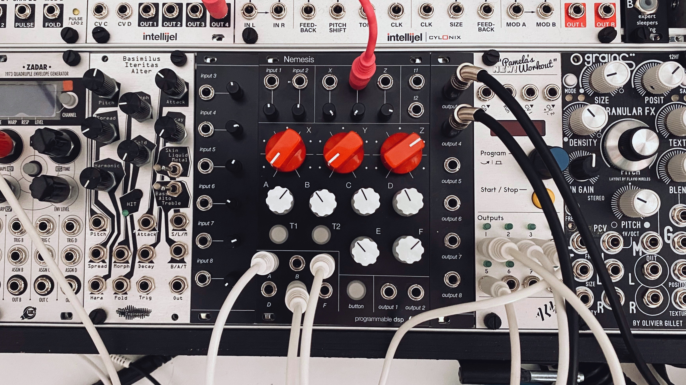

# Nemesis

## multichannel dsp platform for eurorack 

**\hardware** bom, gerber, panel, pcb and schematic files

**\software** project template

**\doc** datasheets and additional information

**\media** 

### license

Hardware: 

Software: 

### specifications

- cirrus cs42448 24 bit audio codec (6 in / 8 out) with additional cs5343 (2 in) 
- teensy 4.1 (arm cortex-m7 at 600 mhz) with 512kb usable `DMAMEM` (can be extended with 2x ESP-PSRAM64 for additional 16mb `EXTMEM`)

- cv Inputs X Y Z with attenuverter
- inputs A-F configurable as cv (0-10V) <u>or</u> ac coupled audio inputs (passive, audio ch. 3-8)
- 2 ch audio in ac or dc coupled with up to 18db gain (full scale at noon 10vpp)
- 2 ch audio out ac or dc coupled (+-5v) 
- **input module:** 6 ac or dc coupled audio-rate inputs with attenuators
- **output module:** 6 ac or dc coupled active audio-rate outputs
